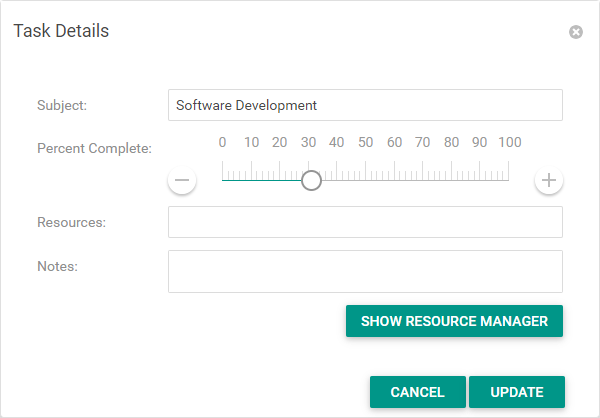

<!-- default badges list -->

[](https://supportcenter.devexpress.com/ticket/details/T948017)
[](https://docs.devexpress.com/GeneralInformation/403183)
[](#does-this-example-address-your-development-requirementsobjectives)
<!-- default badges end -->
# Gantt for  Web Forms - How to implement a custom Task Details dialog 

This example demonstrates how to implement a custom **Task Details** dialog for the Gantt control. 



To display a custom dialog, you should cancel the default dialog showing and display a custom dialog instead. In this example, the custom dialog is implemented using the [ASPxPopupControl](https://docs.devexpress.com/AspNet/DevExpress.Web.ASPxPopupControl).

1. Create [PopupControl](./CS/DXWebApplication/Default.aspx#L87) with the FormLayout inside. Adjust editors in the FormLayout.
2. Handle the client-side [TaskDblClick](https://docs.devexpress.com/AspNet/js-ASPxClientGantt.TaskDblClick) event and prevent the default dialog from showing and display your custom dialog.
    ```js
    function onTaskDblClick(s, e) {
        e.cancel = true;
        hiddenField.Clear();
        hiddenField.Add("taskKey", e.key);
        customTaskDetailsPopup.Show();
    }
    ```
3. In the popup's [Shown](https://docs.devexpress.com/AspNet/js-ASPxClientPopupControlBase.Shown) event handler, call the [GetTaskData](https://docs.devexpress.com/AspNet/js-ASPxClientGantt.GetTaskData%28key%29) method to obtain an edited task's data. [Specify values](./CS/DXWebApplication/Default.aspx#L28) of editors in the dialog.

    ```js
    function onShown(s, e) {
        var currentTask = clientGantt.GetTaskData(hiddenField.Get("taskKey"));
        textBox.SetText(currentTask.Subject);
        trackBar.SetValue(currentTask.PercentComplete);
        memo.SetValue(currentTask.Description);
        currentResources = clientGantt.GetTaskResources(hiddenField.Get("taskKey")).map(r => r.ID);
        tokenBox.SetValue(currentResources.join(","));
    }
    ```
4. Call the [UpdateTask](https://docs.devexpress.com/AspNet/js-ASPxClientGantt.UpdateTask%28key-data%29?p=netframework), [AssignResourceToTask](https://docs.devexpress.com/AspNet/js-ASPxClientGantt.AssignResourceToTask%28resourceKey-taskKey%29), and [UnassignResourceFromTask](https://docs.devexpress.com/AspNet/js-ASPxClientGantt.UnassignResourceFromTask%28resourceKey-taskKey%29) methods to save changes. Hide the popup after saving.

## Files to Review

* [Default.aspx](./CS/DXWebApplication/Default.aspx) (VB: [Default.aspx](./VB/DXWebApplication/Default.aspx))
* [GanttDataProvider.cs](./CS/DXWebApplication/App_Data/GanttDataProvider.cs) (VB: [GanttDataProvider.vb](./VB/DXWebApplication/App_Data/GanttDataProvider.vb))

## Documentation

* [Manage Tasks](https://docs.devexpress.com/AspNet/401579/components/gantt/edit-data/manage-tasks)
<!-- feedback -->
## Does this example address your development requirements/objectives?

[](https://www.devexpress.com/support/examples/survey.xml?utm_source=github&utm_campaign=gantt-for-web-forms-how-to-create-a-custom-task-details-dialog&~~~was_helpful=yes) [](https://www.devexpress.com/support/examples/survey.xml?utm_source=github&utm_campaign=gantt-for-web-forms-how-to-create-a-custom-task-details-dialog&~~~was_helpful=no)

(you will be redirected to DevExpress.com to submit your response)
<!-- feedback end -->
